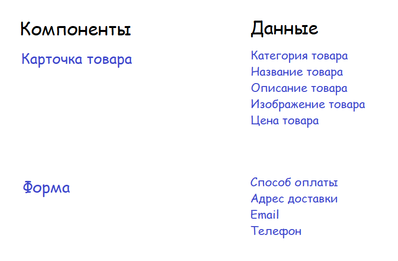

# Проектная работа "Веб-ларек"

Стек: HTML, SCSS, TypeScript, Webpack

Структура проекта:
- src/ — исходные файлы проекта
- src/components/ — папка с JS компонентами
- src/components/base/ — папка с базовым кодом

Важные файлы:
- src/pages/index.html — HTML-файл главной страницы
- src/types/index.ts — файл с типами
- src/index.ts — точка входа приложения
- src/scss/styles.scss — корневой файл стилей
- src/utils/constants.ts — файл с константами
- src/utils/utils.ts — файл с утилитами

## Установка и запуск
Для установки и запуска проекта необходимо выполнить команды

```
npm install
npm run start
```

или

```
yarn
yarn start
```
## Сборка

```
npm run build
```

или

```
yarn build
```

## **Архитектура приложения**

<!--  -->

## Базовый код

### **1. Класс `EventEmitter`**

Реализует паттерн «MVP» и позволяет подписываться на события и уведомлять подписчиков
о наступлении события.

Класс имеет методы `on`, `off`, `emit` — для подписки на событие, отписки от события и уведомления
подписчиков о наступлении события соответственно.

Дополнительно реализованы методы `onAll` и `offAll` — для подписки на все события и сброса всех
подписчиков.

Ещё одним дополнением является метод `trigger`, генерирующий заданное событие с заданными
аргументами. Это позволяет передавать его в качестве обработчика события в другие классы. Эти
классы будут генерировать события, не будучи при этом напрямую зависимыми от
класса `EventEmitter`.


### **2. Класс `Api`**

Реализует отправку запросов серверу, получает данные с сервера.

Конструктор принимает два аргумента - `baseURL: string` (базовый URL) и `options: RequestInit` (объект с заголовками; по умолчанию включает заголовок Content-Type: application/json).

Класс имеет публичные методы `get()` и `post()`.
- `get(uri: string):` отправляет запрос методом GET по указанному URI и возвращает данные (или ошибку) в виде промиса.
- `post(uri: string, data: object, method: ApiPostMethods = 'POST'):` отправляет данные (data) методом POST/PUT/DELETE по указанному URI и возвращает ответ в виде промиса.

Дополнительно реализован защищённый метод `handleResponse`— для обработки ответа сервера. Если ответ успешный, возвращает данные. В противном случае возвращает ошибку, если она присутствует.

### **3. Класс `ShopApi` расширяет `Api`**

Методы:
- `getCatalogItems` - Получает список товаров с сервера.

---

## **Компоненты модели данных**


---

### **1. Класс `ICatalogItem` расширяет `Model<T>`**
Модель данных продукта. Хранит в себе информацию о товаре:
- `id: string` - Идентификатор товара;
- `category: string` - Категория товара;
- `name: string` - Название товара;
- `description: string` - Описание товара;
- `image: string` - Путь к изображению (string);
- `price: number` - Цена товара;

---

### **2. Класс `BasketState` расширяет `Model<T>`**

Реализует модель данных корзины.

Поля:
- `basketItems: string[]` - список id товаров, которые пользователь добавил в корзину.

Методы:
- `addToBasket(itemId: string)` - добавление товара в корзину;
- `removeFromBasket(itemId: string)` - удаление товара из корзины;
- `isInBasket(itemId: string)` - проверка, находится ли товар в корзине;
- `clearBasket()` - полная очистка корзины (производится после оформления заказа);
- `getBasketLength()` - получение количества товаров в корзине.

---
  
### **3. Класс `AppState` расширяет `Model<T>`**

Поля:
- `catalog` - Список товаров в каталоге
- `basket` - Экземпляр класса `Basket`, предоставляющий методы работы с корзиной (и хранящий данные корзины).
- `preview` - ID товара, который в данный момент предпросматривается пользователем.
- `loadingCatalog` - Состояние загрузки каталога (Для отображения Loader).
- `order` - Объект, содержащий информацию о способе оплате, адресе доставки.
- `contacts` - Объект, содержащий email и номер телефона пользователя.
- `formErrors` - Список ошибок в форме.

Содержит список товаров в каталоге (`items: IProduct[]`). В компоненте реализованы следующие методы: 
- `setItems(items: IProduct[]): void` - для установки товаров после загрузки из API;
- `getItemsFromBasket(): CatalogItem[]` - получение выборки товаров, которые находятся в корзине;
- `getTotalPrice(): number` - получение общей стоимости товаров, которые находятся в корзине;
- `setOrderField(field: string, value: string), setContactsField(field: string, value: string)` 
методы для изменения данных, которые указал пользователь в полях ввода форм;
- `validateOrder(), validateContacts()` - проверка валидности полей ввода в соответствующих формах.

---

## **Компоненты представления**

### **1. Класс `Component`**

Предоставляет методы работы с классами как с компонентами. К таким методам относятся:
- `render (data: T)` - Принимает данные и отрисовывает их благодаря `set func()`
- `toggleClass(element: HTMLElement, className: string)` - Переключение класса
и прочие...

### **2. Класс `BasketItem` расширяет `Component`**
Отображает карточки товаров в корзине.
- `title: HTMLSpanElement` - Заголовок товара в корзине;
- `price: HTMLSpanElement` - Цена товара в корзине;
- `index: HTMLSpanElement` - Цена товара в корзине;
- `removeButton: HTMLButtonElement` - Кнопка удаления товара из корзины;

Конструктор принимает контейнер и объект IEvents для работы с событиями.
В конструкторе инициализируются поля (осуществляется поиск элементов), устанавливаются слушатели событий.

### **3. Класс `Basket`**
Отображает корзину.

### **4. Класс `Page`**
Отображает каталог и количество товаров в корзине.

### **5. Класс `CardPreview`**
Отображает информацию о товаре в режиме предпросмотра.

### **6. Класс `Form`**
Предоставляет общий интерфейс работы с формами.

### **7. Класс `Order`**
Отображает форму для указания адреса и способы оплаты при оформлении заказа, управляет состояниями формы.

### **8. Класс `Contacts`**
Отображает форму для указания контактов (email, номер телефона) при оформлении заказа, управляет состояниями формы.

### **9. Класс `Modal`**
Предоставляет интерфейс работы с модальными окнами.

### **10. Класс `Success`**
Отображает информацию об успешной покупке (сообщение пользователю + стоимость заказа).